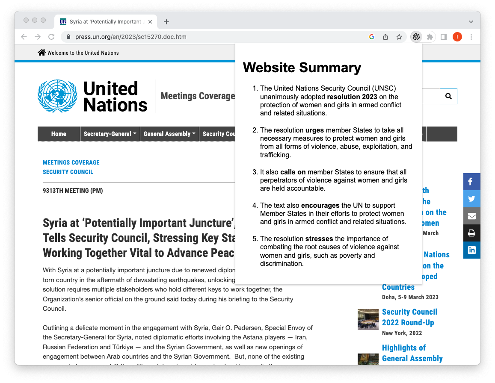

# Chrome Plugin for ChatGpt Website Abstract
I often wished that there was a tool that checks the content of a website and gives you an abstract or a bullet list with the covered topics.

Well afaik there is none

So I wrote one by my own ... to be honest with the help of chatGPT, as I am a native Swift developer and normally don't touch JavaScript at all

## How it works

When you use it on an any public available URL, it queries the OpenAI API and presents you a 5 bullet list of it´s content with important words highlighted. 

You have to use your own API key, that you can create at https://platform.openai.com/account/api-keys

## Example Screen

This is my first Chrome plugin. 
